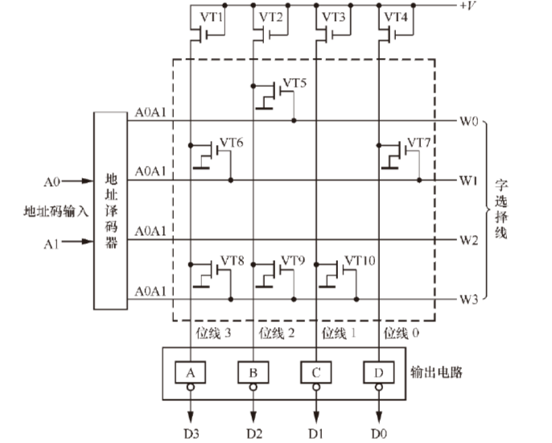
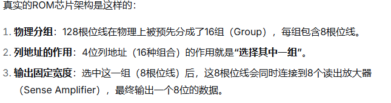

# rom的介绍

**ROM** 是 **Read-Only Memory**（只读存储器）的缩写。

核心特点是：

​		**在正常使用情况下，里面的数据只能被读取，不能被修改或写入**，并且**断电后数据不会丢失**（非易失性）；


rom和ram都是hard macro ip，只是vendor会提供一些仿真模型或者可综合模型给客户用于仿真使用；

ROM的存储单元是由一系列特定排列的晶体管组成的，其物理实现与晶圆厂（Foundry，如台积电、三星）的**具体工艺制程（如5nm、7nm、28nm）深度绑定**，使ppa更优。


客户能看到的是接口（地址线、数据线、控制信号）和对应的行为模型，但其内部晶体管级的物理实现是隐藏的；

所以我们目前的coding，只是去实现了一个rom的模型而已；

# rom接口定义


| 信号      | 方向   | 含义                                                         |
| --------- | ------ | ------------------------------------------------------------ |
| A[n:0]    | input  | 地址总线，用于选择要读取的存储单元；地址线的数量决定rom的容量 |
| Q/DQ[m:0] | output | 用于输出从指定地址读取到的数据; 宽度常为8/16/32 bits         |
| CE#/CEn   | input  | 低电平有效的片选信号，<br>只有当该信号有效时，rom芯片才被激活，响应外部操作 |
| OE#/OEn   | input  | 低电平有效的读使能信号<br>当该信号有效时，rom才将数据驱动到数据总线上； |


为什么rom没有clk呢？

传统ROM（如EPROM、早期的并行NOR Flash）在读取时，其内部逻辑是纯组合逻辑（Combinational Logic）；

```markdown
	直接映射：当你把地址（Address）送到芯片的地址引脚上时，这个地址信号会直接进入芯片内部一个巨大的译码器（Decoder）
	物理直连：译码器会直接选中对应的存储单元（由MOS管构成），存储单元要么导通（代表0），要么截止（代表1）。
	电平直达：这种导通或截止状态会直接通过位线（Bit-line）反映到芯片的输出引脚（Data Out）上。
```



例如：当A0 ＝ 1、A1 ＝ 1 时，输出数据为D3＝ 0，D2 ＝ 1，D1 ＝ 0，D0 ＝ 0，即为0100；

分析可知，图中的这一掩模式只读存储器保存的4 个字数据分别是0100，1001，0000 和1110。这种结构的只读存储器，称为字译码结构只读存储器；

双译码结构的掩模式只读存储器：

​	上图就是传统的单译码方式；**芯片面积过大**和**内部连线过于复杂**的问题；	

​	传统的单译码方式：

​			N根地址线 -----> 2^N根字选择线   -----> 每根线直接选中一个存储单元;

​			注意：通过上图了解到，一个存储单元的含义并不是我们理解的那样，而是位线上输出电平的一种组合可能，然后位线上挂一些cmos,控制其开关进而控制线位上的输出电平；

​	双译码结构方式：

​			地址线分组：行地址/列地址；

​			两个译码逻辑；

​			以1024单元为例，

​					传统译码方式，10根地址线，译码后将产生1024根线；

​					5x5的方式：10根地址线（其中，5根行地址，5根列地址），分别经过译码器后，将产生32（行）+32（列） = 64根线；大大降低了译码后的线，进而简化了rom内部的布局布线；			

​			原理:

​                行地址方向： 行地址译码器从输入的地址中取出“行地址”部分，进行译码后，在存储矩阵的众多**字线（Word Line）**中选中唯一的一根（即选中某一行）；

​				列地址方向：与此同时，列地址译码器对“列地址”进行译码，在**位线（Bit Line）**中选中特定的一根或一组（即选中某一列）；

```
地址译码器并不一定是传统意义上的译码器，可能是mux逻辑，只是称为列地址译码器；
芯片内部的地址线非常细，信号很“弱”，无法直接驱动MUX内部数量庞大的传输门（可能成百上千个）。而译码器可以作为一个信号放大器，输出一根“强壮”的全局选择线（通常称为Y-SELECT线），这根线的驱动能力足以控制整列的传输门
```

​		


专业术语：

​	字选择线，位线


------

上面只是介绍了一个传统的rom结构，和一些基础知识；

后续还需要延伸，待补充；


